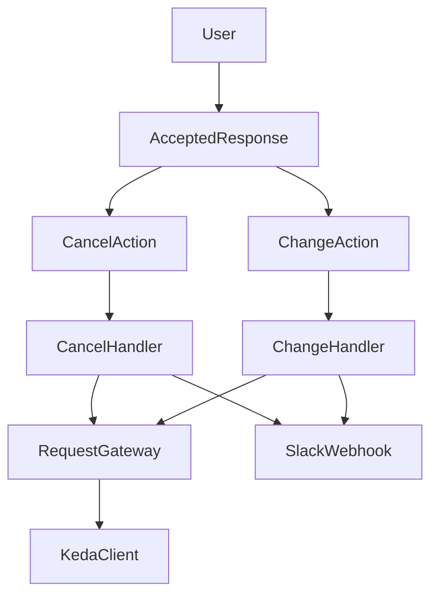
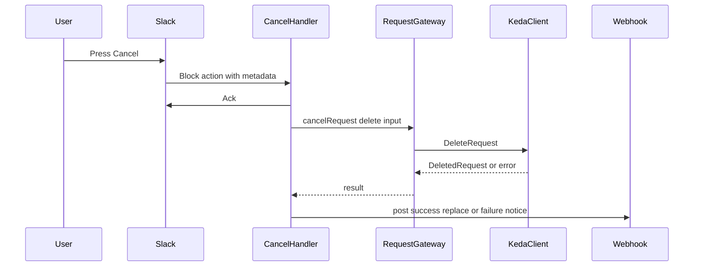

# Design Document

## Overview

この feature は、Slack `/launch` 利用者が accepted 済みの KEDA launch request を、同じ accepted response から直接取り消せるようにする。既存の change duration と同じ request lifecycle 上に cancel を追加し、request id と ScaledObject を再入力させずに delete API を呼び出す。

対象利用者は `/launch` 実行者であり、Slack 上の ephemeral response を操作面として使う。現在の `internal/kedalaunch` は launch submit と change duration をすでに扱っているため、この設計はその extension として accepted response artifact、KEDA client seam、Slack callback 登録を最小限に広げる。

### Goals
- accepted response に cancel 導線を追加する
- accepted response の metadata を使って delete API を実行する
- cancel 成功時は Slack 上で canceled 状態を確認できるようにする
- cancel 失敗時は request が未取消であることを利用者に返す

### Non-Goals
- launch 対象一覧 UI の導入
- cancel 確認 modal の追加
- receiver 側の delete 意味論や error contract の変更
- `internal/kedalaunch` 全体の大規模リネームや package 再編

## Boundary Commitments

### This Spec Owns
- accepted response における cancel button の表示と metadata 付与
- Slack block action からの cancel 実行フロー
- upstream client `DeleteRequest` の呼び出しと、その結果を Slack 応答へ変換すること
- cancel 成功時の response artifact と、失敗時の利用者通知

### Out of Boundary
- KEDA launcher receiver が `404` をどのように意味づけるかの変更
- 一覧 API を用いた launch 対象選択や request 管理画面
- Slack 権限制御や複数利用者間の可視性ルール変更
- accepted response 以外から request を cancel する新しい UI

### Allowed Dependencies
- `github.com/Kotaro7750/keda-launcher-scaler v0.1.4` の `pkg/client` と `pkg/client/http`
- 既存の `slack-go/slack` および `socketmode`
- 既存 `internal/kedalaunch` の ack / webhook response helper

### Revalidation Triggers
- upstream `DeleteRequest` / `DeletedRequest` の shape 変更
- accepted response metadata の必須項目変更
- Slack follow-up 操作が accepted response 以外へ移る変更
- KEDA request timeout や response posting の責務境界変更

## Architecture

### Existing Architecture Analysis
- `register.go` が `/launch` と関連 callback を登録し、user flow 順に handler を並べている。
- `launch_request.go` は launch の upstream 呼び出しと timeout を所有し、Slack response posting は caller に任せている。
- `accepted_response.go` は accepted message artifact を組み立て、change duration button metadata を埋め込んでいる。
- `change_duration.go` と `change_duration_modal.go` は accepted response を起点に request id と ScaledObject を維持した再送を行っている。

この feature では既存の dependency direction を維持する。

`Accepted response artifact and metadata` → `cancel flow handler` → `KEDA request gateway` → `upstream client`

Slack ack と webhook posting は `cancel flow handler` から `slack_response.go` を通じて利用するが、upstream delete 呼び出し自体は gateway seam に閉じる。

### Architecture Pattern & Boundary Map



- **Selected pattern**: accepted response 起点の follow-up action extension
- **Domain boundaries**:
  - accepted response artifact は button 表示と metadata 契約を所有する
  - cancel handler は Slack callback orchestration と利用者通知を所有する
  - request gateway は timeout 付き upstream client 呼び出しを所有する
- **Existing patterns preserved**:
  - Slack interactive event は外部呼び出し前に ack する
  - KEDA 送信処理と Slack 通知処理を分ける
  - Slack artifact と metadata は artifact 近傍に置く
- **New components rationale**:
  - cancel flow 専用 handler file は change duration と責務を分けて user flow を追いやすくする
  - accepted response metadata の共通化は follow-up action の追加に必要な最小 generalization である
- **Steering compliance**:
  - user flow を主軸にした file split を維持する
  - upstream client をそのまま採用し、独自 wrapper を増やさない

### Technology Stack

| Layer | Choice / Version | Role in Feature | Notes |
|-------|------------------|-----------------|-------|
| Backend | Go 1.26.2 | 実装言語 | 既存 repo と同一 |
| Slack Integration | `github.com/slack-go/slack` v0.23.0 | block action 受信、webhook response posting | 既存 Socket Mode path を継続 |
| Upstream Client | `github.com/Kotaro7750/keda-launcher-scaler` v0.1.4 | `DeleteRequest` と `DeletedRequest` を提供 | `go.mod` 更新が必要 |
| Runtime | existing Socket Mode app | ack と callback 実行環境 | Slack timeout 回避が要件 |

## File Structure Plan

### Directory Structure
```text
internal/kedalaunch/
├── register.go                # /launch 関連 callback の登録順を管理
├── command.go                 # Slack flow が使う upstream seam を定義
├── launch_request.go          # launch と cancel の upstream request gateway
├── accepted_response.go       # accepted response artifact、follow-up metadata、cancel success artifact
├── cancel_request.go          # cancel button callback、delete orchestration、Slack posting
├── change_duration.go         # duration change flow
├── change_duration_modal.go   # change duration modal artifact
├── launch_submission.go       # launch submit flow
└── slack_response.go          # ack と generic error response helper
```

### Modified Files
- `go.mod` — `github.com/Kotaro7750/keda-launcher-scaler` を `v0.1.4` へ更新する
- `go.sum` — dependency update に伴う checksum 更新
- `internal/kedalaunch/command.go` — `kedaLauncher` に `DeleteRequest` を追加する
- `internal/kedalaunch/register.go` — cancel action handler を登録し、user flow 順を保つ
- `internal/kedalaunch/launch_request.go` — cancel 用の timeout 付き upstream helper を追加する
- `internal/kedalaunch/accepted_response.go` — cancel button、共通 metadata encode/decode、canceled success message を追加する
- `internal/kedalaunch/change_duration.go` — accepted response metadata の新しい ownership に追従する
- `internal/kedalaunch/change_duration_modal.go` — accepted response metadata の共通契約を consume する形へ調整する
- `internal/kedalaunch/accepted_response_test.go` — change と cancel の両 button metadata を検証する
- `internal/kedalaunch/change_duration_modal_test.go` — metadata 共通化後も change が request id / ScaledObject を維持することを検証する

### New Files
- `internal/kedalaunch/cancel_request.go` — cancel flow の handler と message posting を持つ
- `internal/kedalaunch/cancel_request_test.go` — cancel request 変換と canceled success artifact を検証する

## System Flows



Key decisions:
- ack は metadata decode や upstream delete より前に実行する
- success は元の accepted response を canceled 状態へ置換する
- failure は元 message を残し、request が未取消であることだけを通知する

## Requirements Traceability

| Requirement | Summary | Components | Interfaces | Flows |
|-------------|---------|------------|------------|-------|
| 1.1 | accepted response に cancel 導線を表示する | `accepted_response.go` | accepted response artifact contract | Cancel flow |
| 1.2 | request context を再入力させない | `accepted_response.go`, `cancel_request.go` | accepted request metadata | Cancel flow |
| 1.3 | `/launch` フロー配下で完結する | `register.go`, `cancel_request.go` | Slack block action handler | Cancel flow |
| 2.1 | request id と ScaledObject に対して cancel を実行する | `cancel_request.go`, `launch_request.go` | `DeleteRequest` service interface | Cancel flow |
| 2.2 | cancel 成功を Slack へ通知する | `cancel_request.go`, `accepted_response.go` | canceled success message contract | Cancel flow |
| 2.3 | Slack timeout で再試行を強いられない | `cancel_request.go`, `slack_response.go` | ack sequencing rule | Cancel flow |
| 3.1 | metadata 不正時は cancel せず利用者へ通知する | `cancel_request.go`, `accepted_response.go` | metadata decode contract | Cancel flow |
| 3.2 | delete 失敗時は request 未取消を通知する | `cancel_request.go`, `slack_response.go` | failure response contract | Cancel flow |
| 3.3 | 成功/失敗どちらでも利用者が判断できる応答を返す | `accepted_response.go`, `cancel_request.go`, `slack_response.go` | success and failure message contracts | Cancel flow |

## Components and Interfaces

| Component | Domain | Intent | Requirements | Key Dependencies | Contracts |
|-----------|--------|--------|--------------|------------------|-----------|
| Accepted Response Artifact | Slack artifact | accepted message と follow-up metadata を組み立てる | 1.1, 1.2, 2.2, 3.1, 3.3 | `slack-go/slack` P0, `domainclient` P0 | Service, State |
| Cancel Request Flow | Slack callback | cancel action を ack し、delete 実行と Slack 通知を orchestration する | 1.3, 2.1, 2.2, 2.3, 3.1, 3.2, 3.3 | Accepted Response Artifact P0, Request Gateway P0, `slack_response.go` P1 | Service |
| Request Gateway | Upstream integration | timeout 付きで launch と cancel の upstream 呼び出しを行う | 2.1, 2.3 | `keda-launcher-scaler/pkg/client` P0 | Service |

### Slack Artifact Layer

#### Accepted Response Artifact

| Field | Detail |
|-------|--------|
| Intent | accepted request の表示状態と follow-up action metadata を一貫して所有する |
| Requirements | 1.1, 1.2, 2.2, 3.1, 3.3 |

**Responsibilities & Constraints**
- accepted response 本文に request id、ScaledObject、duration、effective window を表示する
- change と cancel の両 button に同一 request lifecycle metadata を付与する
- cancel success 後の replaced message を組み立てる
- metadata 必須項目は `requestId`, `namespace`, `name`, `responseURL` とし、change でだけ `duration` を持つ

**Dependencies**
- Outbound: `slack-go/slack` — message blocks と button element 生成 (P0)
- External: `domainclient.AcceptedRequest` / `domainclient.DeletedRequest` — upstream response shape (P0)

**Contracts**: Service [x] / API [ ] / Event [ ] / Batch [ ] / State [x]

##### Service Interface
```go
type acceptedRequestMetadata struct {
	RequestID   string
	Namespace   string
	Name        string
	Duration    string
	ResponseURL string
}

func acceptedLaunchMessage(
	accepted domainclient.AcceptedRequest,
	req domainclient.LaunchRequest,
	responseURL string,
	replaceOriginal bool,
) *slack.WebhookMessage

func canceledLaunchMessage(
	deleted domainclient.DeletedRequest,
	responseURL string,
) *slack.WebhookMessage

func encodeAcceptedRequestMetadata(metadata acceptedRequestMetadata) (string, error)
func decodeAcceptedRequestMetadata(value string) (acceptedRequestMetadata, error)
```
- Preconditions:
  - `responseURL` は空でない
  - metadata は request id と ScaledObject を持つ
- Postconditions:
  - accepted message は change と cancel の follow-up action を含む
  - canceled message は follow-up action を含まない
- Invariants:
  - accepted response metadata は request target を変更しない
  - cancel success message は current request state を final として表す

**Implementation Notes**
- Integration:
  - 既存 `findButton` ベースの artifact test を拡張し、cancel button も検証する
- Validation:
  - metadata decode 時に必須項目欠落なら error を返す
- Risks:
  - metadata ownership の移動で change flow が壊れないよう、change test を維持する

### Callback Flow Layer

#### Cancel Request Flow

| Field | Detail |
|-------|--------|
| Intent | accepted response の cancel action を delete 実行と Slack 応答へ変換する |
| Requirements | 1.3, 2.1, 2.2, 2.3, 3.1, 3.2, 3.3 |

**Responsibilities & Constraints**
- Slack block action payload から metadata を取り出す
- ack を先に返した上で delete を実行する
- success なら replaced canceled message を投稿する
- failure なら request が未取消であることを ephemeral error として投稿する
- metadata が壊れている場合は delete を呼ばない

**Dependencies**
- Inbound: `register.go` — cancel action registration (P0)
- Outbound: Request Gateway — upstream delete 実行 (P0)
- Outbound: `slack_response.go` — error response posting (P1)
- Outbound: Accepted Response Artifact — success message と metadata decode (P0)

**Contracts**: Service [x] / API [ ] / Event [ ] / Batch [ ] / State [ ]

##### Service Interface
```go
func (c *kedaLaunchCommand) handleCancelAction(
	evt *socketmode.Event,
	client *socketmode.Client,
)
```
- Preconditions:
  - payload は cancel button block action である
- Postconditions:
  - Slack event は一度だけ ack される
  - metadata 正常時は delete を最大 1 回だけ試みる
  - success 時は `ReplaceOriginal` された success message が投稿される
- Invariants:
  - request id と ScaledObject は metadata 由来で固定される
  - failure は request active state を保持する前提で original message を残す

**Implementation Notes**
- Integration:
  - `register.go` では launch submit の後に follow-up action として登録する
- Validation:
  - metadata 不正時の early error posting を行う
- Risks:
  - response URL が stale な場合でも receiver delete 実行は行われるため、post 失敗は log に残す

### Upstream Integration Layer

#### Request Gateway

| Field | Detail |
|-------|--------|
| Intent | timeout 付きで upstream launch と cancel を実行する |
| Requirements | 2.1, 2.3 |

**Responsibilities & Constraints**
- `kedaLauncher` interface に必要最小限の method だけを定義する
- `launchRequest` と `cancelRequest` の両方で同じ timeout policy を適用する
- Slack response posting は持たない

**Dependencies**
- Inbound: `launch_submission.go` — launch 実行 (P0)
- Inbound: `cancel_request.go` — cancel 実行 (P0)
- External: `domainclient.Client` subset — upstream transport-agnostic contract (P0)

**Contracts**: Service [x] / API [ ] / Event [ ] / Batch [ ] / State [ ]

##### Service Interface
```go
type kedaLauncher interface {
	Launch(context.Context, domainclient.LaunchRequest) (domainclient.AcceptedRequest, error)
	DeleteRequest(context.Context, domainclient.DeleteRequest) (domainclient.DeletedRequest, error)
}

func (c *kedaLaunchCommand) launchRequest(req domainclient.LaunchRequest) (domainclient.AcceptedRequest, error)
func (c *kedaLaunchCommand) cancelRequest(req domainclient.DeleteRequest) (domainclient.DeletedRequest, error)
```
- Preconditions:
  - request id と ScaledObject は trim 済みである
- Postconditions:
  - upstream call は timeout 付き context で実行される
- Invariants:
  - timeout policy は launch と cancel で揃える

**Implementation Notes**
- Integration:
  - `httpclient.New` から返る upstream client をそのまま使う
- Validation:
  - compile 時に `kedaLauncher` subset と upstream `HTTPClient` の整合を確認する
- Risks:
  - upstream version mismatch は dependency bump 時の build/test で検出する

## Data Models

### Domain Model
- **Accepted Request Lifecycle Metadata**
  - accepted response が follow-up 操作へ渡す value object
  - request target identity を所有するが、request state 自体は所有しない
- **Delete Request**
  - upstream delete 実行の command object
  - `requestId` と `ScaledObject` のみを持つ
- **Deleted Request**
  - upstream 成功時の response object
  - canceled が適用された effective window を利用者に示す

### Logical Data Model

**Structure Definition**:
- `acceptedRequestMetadata`
  - `requestId: string`
  - `namespace: string`
  - `name: string`
  - `responseURL: string`
  - `duration: string` optional for change flow reuse
- `domainclient.DeleteRequest`
  - `requestId`
  - `scaledObject.namespace`
  - `scaledObject.name`
- `domainclient.DeletedRequest`
  - `requestId`
  - `scaledObject`
  - `effectiveStart`
  - `effectiveEnd`

**Consistency & Integrity**:
- metadata は Slack button value と modal private metadata 間でのみ受け渡す
- cancel flow は metadata を authority として使い、他入力で request target を上書きしない
- persistent storage は追加しない

### Data Contracts & Integration

**API Data Transfer**
- Upstream client contract:
  - method: `DeleteRequest(ctx, req)`
  - request: `DeleteRequest{requestId, scaledObject}`
  - success: `DeletedRequest`
  - errors: transport error または upstream 404 を含む error

**Cross-Service Data Management**
- distributed transaction は持たない
- Slack response posting と upstream delete は独立 operation であり、delete 成功後の Slack post 失敗は再試行責務をこの spec では持たない

## Error Handling

### Error Strategy
- metadata decode failure は user-visible error として扱い、delete を呼ばない
- upstream delete failure は request 未取消として通知する
- Slack post failure は log に残すが、delete 自体の結果を巻き戻さない

### Error Categories and Responses
- **User visible state errors**:
  - metadata invalid → `Failed to cancel launch request.` 系の error を ephemeral で返す
  - delete failed or rejected → request がまだ active かもしれないことを示す error を返す
- **System errors**:
  - Slack webhook post failure → log only
  - upstream timeout or transport failure → request 未取消として通知

### Monitoring
- `requestId`, `scaledObject.namespace`, `scaledObject.name` を cancel log に含める
- metadata decode failure と upstream delete failure を別 message で log し、切り分け可能にする

## Testing Strategy

### Unit Tests
- `accepted_response_test.go`: accepted response が change と cancel の両 button を持ち、cancel button metadata に request id と ScaledObject が入ることを検証する
- `cancel_request_test.go`: accepted request metadata から `domainclient.DeleteRequest` を構成できることを検証する
- `cancel_request_test.go`: canceled success message が `ReplaceOriginal` され、follow-up action を持たないことを検証する
- `change_duration_modal_test.go`: metadata 共通化後も change flow が duration だけ変更し、request id / ScaledObject を維持することを検証する

### Integration Tests
- `go test ./...` により `kedaLauncher` interface と upstream `v0.1.4` の compile compatibility を確認する
- cancel 追加後も既存 launch modal と change duration の parse / validation test が通ることを確認する

### E2E or User Flow Checks
- accepted launch response から Cancel を押した利用者が canceled 状態を Slack で確認できる
- metadata 不正または delete 失敗時に、利用者が request 未取消だと判断できる Slack 応答を受ける

### Performance or Load
- cancel action は launch / change と同様に外部呼び出し前 ack を維持し、Slack interactive timeout を避ける

## Performance & Scalability
- この feature で追加される外部呼び出しは 1 回の `DeleteRequest` のみで、既存 launch path と同等の負荷特性である
- timeout policy は既存 `kedaLaunchTimeout` を再利用し、新しい retry layer は導入しない

