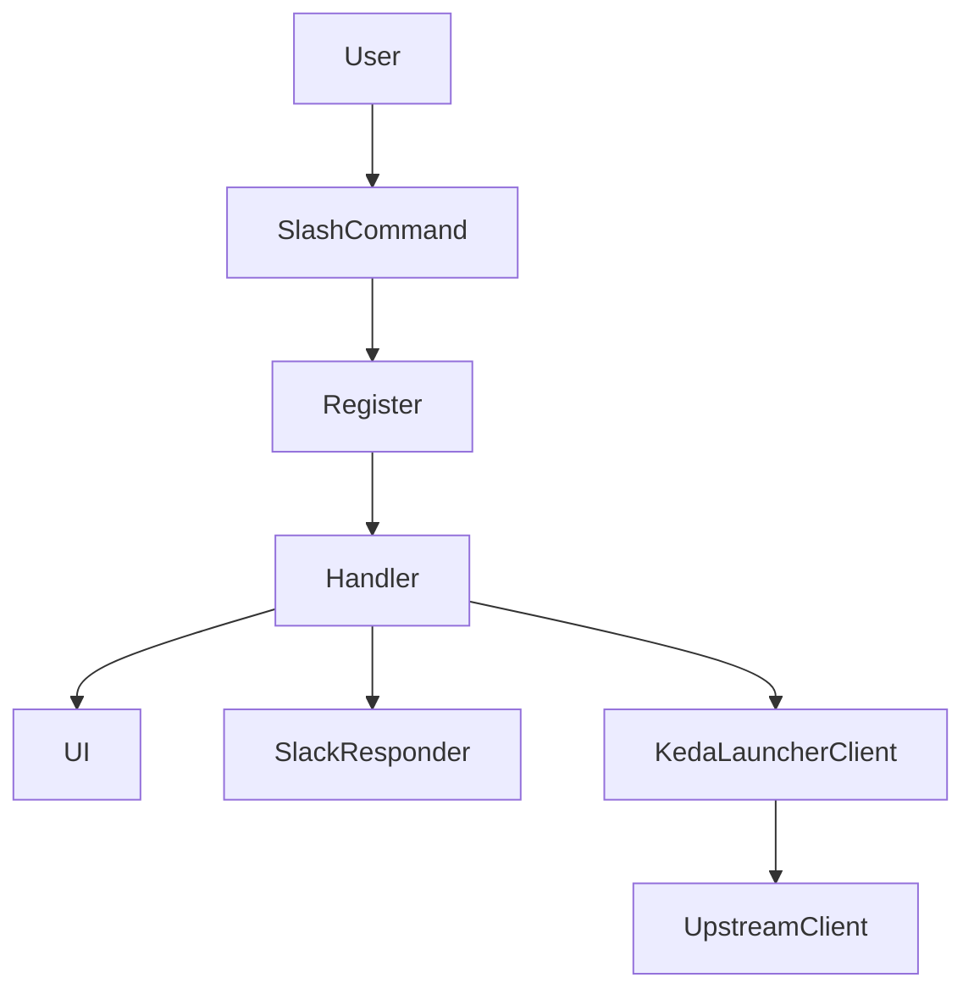
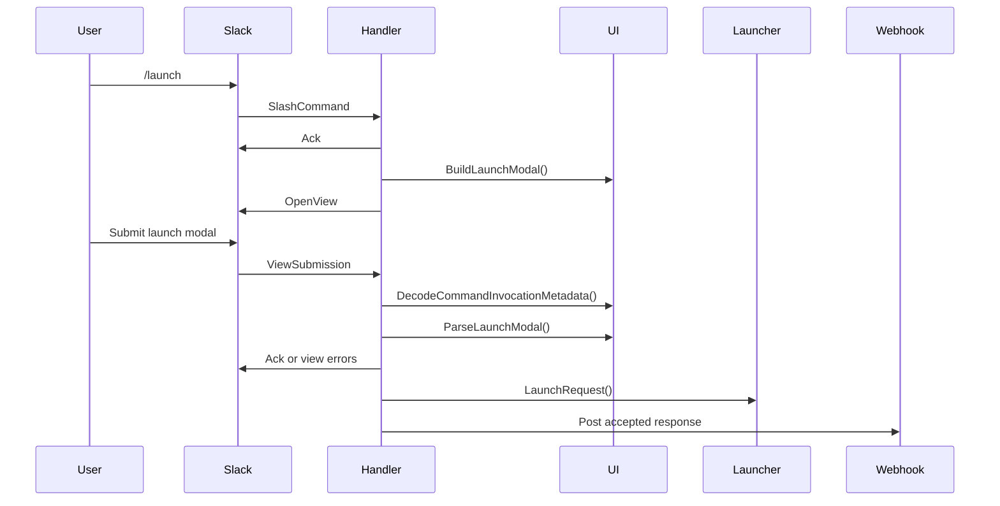
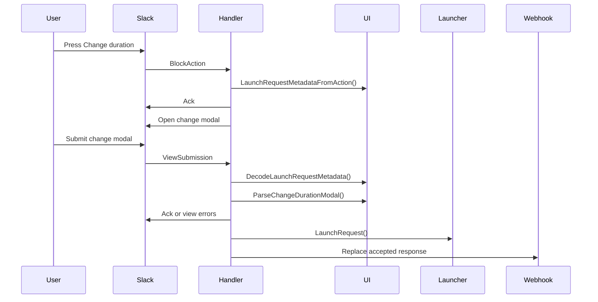
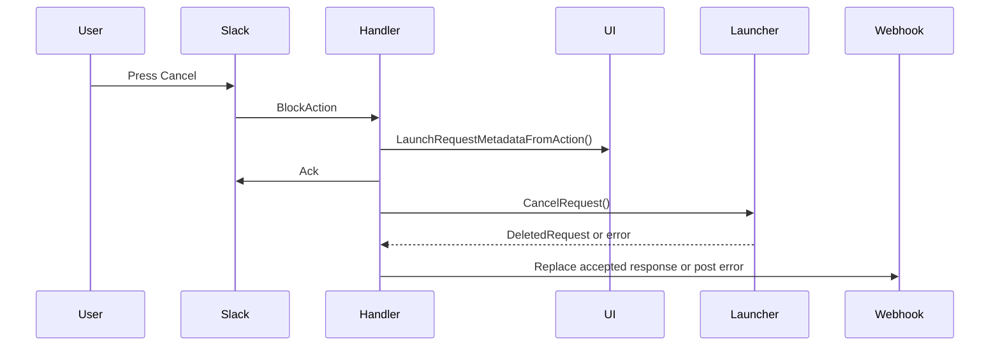

# Design Document

## Overview

この feature は、Slack `/launch` フローで受理済みになった KEDA launch request を、同じ accepted response から変更または取り消しできるようにする。現在の実装では、初回 slash command から launch modal を開き、modal submit で launch を送信し、accepted response に `Change duration` と `Cancel` の follow-up action を表示する。

初期の設計では `internal/kedalaunch` 直下のファイル分割を前提にしていたが、現在のコードベースでは責務が次の 4 層に整理されている。

- `register.go`: feature の配線と callback 登録
- `handler/`: Slack event の orchestration
- `ui/`: modal / message / metadata artifact
- `keda_launcher_client/`, `slack_responder/`: 外部依存との小さな feature-local seam

この設計書は、実装済みの現在構成を source of truth として記述する。

### Goals

- accepted response から duration change と cancel を実行できる
- request id と ScaledObject を再入力させず、accepted response の metadata を再利用する
- Slack interactive event は upstream 呼び出し前に ack する
- launch / change / cancel の Slack 応答と upstream KEDA request 実行を分離する

### Non-Goals

- request 一覧 UI や管理画面の導入
- cancel 確認 modal の追加
- upstream receiver の API 契約変更
- `main.go` まで含む broader app architecture の再設計

## Boundary Commitments

### This Spec Owns

- `/launch` feature 内で使う modal, accepted response, cancel success response の artifact
- accepted response から follow-up action へ渡す metadata contract
- launch / change / cancel の Slack callback orchestration
- upstream `Launch` / `DeleteRequest` 呼び出しに対する timeout policy

### Out of Boundary

- `keda-launcher-scaler` 側の `DeleteRequest` / `DeletedRequest` 意味論
- Slack App 設定、権限、slash command のインストールフロー
- accepted response 以外の UI からの request 変更・取消
- response URL post failure に対する retry / durable queue

### Allowed Dependencies

- `github.com/slack-go/slack` と `socketmode`
- `github.com/Kotaro7750/keda-launcher-scaler/pkg/client`
- `github.com/Kotaro7750/keda-launcher-scaler/pkg/client/http`

### Revalidation Triggers

- accepted response metadata の必須項目変更
- Slack callback / action ID の変更
- upstream client interface の shape 変更
- `internal/kedalaunch` の package 境界変更

## Current Architecture

### High-Level Structure



- `Register` は Slack handler 登録順を user flow 順に保つ
- `Handler` は Slack payload の decode, ack, upstream call, Slack response posting を orchestration する
- `UI` は modal / message / metadata の artifact を所有する
- `SlackResponder` は Socket Mode ack と Slack Web API / response URL posting をまとめる
- `KedaLauncherClient` は feature-local timeout policy だけを追加し、upstream client の API を隠しすぎない

### Flow Ordering

`register.go` は、利用者がたどる順序で callback を登録する。

1. slash command
2. launch modal submit
3. accepted response の change action
4. accepted response の cancel action
5. change duration modal submit

この順番により、巨大な flow 集約ファイルを作らずに user-visible flow を追えるようにしている。

## File Structure

### Current Directory Structure

```text
internal/kedalaunch/
├── register.go
├── handler/
│   ├── handler.go
│   ├── slash_command.go
│   ├── launch_submission.go
│   ├── change_duration.go
│   └── cancel_request.go
├── keda_launcher_client/
│   ├── interface.go
│   └── launcher.go
├── slack_responder/
│   ├── interface.go
│   └── slack_responder.go
└── ui/
    ├── callback_id.go
    ├── helper.go
    ├── metadata.go
    ├── launch_modal.go
    ├── change_duration_modal.go
    ├── accepted_message.go
    └── cancel_message.go
```

### Responsibility Map

| Path | Responsibility |
|------|----------------|
| `register.go` | upstream client と Slack responder を組み立て、callback を登録する |
| `handler/handler.go` | handler が共有する依存を保持する |
| `handler/slash_command.go` | slash command の ack と launch modal open を行う |
| `handler/launch_submission.go` | launch modal submit を parse し、launch request を送る |
| `handler/change_duration.go` | change action と change submit を扱う |
| `handler/cancel_request.go` | cancel action を delete request と Slack response に変換する |
| `ui/metadata.go` | slash command context と accepted response metadata の encode/decode を持つ |
| `ui/launch_modal.go` | launch modal と launch request 変換を持つ |
| `ui/change_duration_modal.go` | change duration modal と duration-only update 変換を持つ |
| `ui/accepted_message.go` | accepted response artifact を組み立てる |
| `ui/cancel_message.go` | canceled response artifact を組み立てる |
| `slack_responder/` | Slack ack, modal open, response URL post の小さな adapter |
| `keda_launcher_client/` | upstream launch / delete を timeout 付きで実行する |

## System Flows

### 1. Launch Flow



### 2. Change Duration Flow



### 3. Cancel Flow



## Components and Interfaces

### `register.go`

`Register()` は feature の composition root であり、以下を行う。

- `SLACK_LAUNCH_COMMAND` が `/` で始まることを検証する
- `httpclient.New(cfg.ReceiverURL)` で upstream HTTP client を構築する
- `handler.NewKedaLaunchHandler(...)` に launcher と Slack responder を渡す
- Slack callback を flow 順で登録する

このファイルは wiring に集中し、UI artifact や business logic を持たない。

### `handler.KedaLaunchHandler`

`KedaLaunchHandler` は `/launch` feature の orchestration 層である。保持する依存は次の 3 つだけ。

- `kedaLauncher`: upstream launch / delete 実行
- `slackResponder`: Slack ack と follow-up response
- `now`: request id 生成のための clock seam

各 handler の責務は次の通り。

- `HandleSlashCommand`: slash command を ack し、launch modal を開く
- `HandleLaunchSubmission`: launch modal を parse し、launch accepted response を返す
- `HandleChangeAction`: accepted response metadata から change modal を開く
- `HandleChangeSubmission`: duration だけを差し替えて launch を再送し、元メッセージを置換する
- `HandleCancelAction`: accepted response metadata から delete request を作り、canceled message へ置換する

### `ui` package

`ui` は Slack artifact と artifact 間の state contract を所有する。

#### Metadata Contracts

```go
type CommandInvocationMetadata struct {
    UserID      string
    ChannelID   string
    ResponseURL string
}

type LaunchRequestMetadata struct {
    RequestID   string
    Namespace   string
    Name        string
    Duration    string
    ResponseURL string
}
```

- `CommandInvocationMetadata` は slash command から initial launch modal submit までの文脈を保持する
- `LaunchRequestMetadata` は accepted response から change / cancel の follow-up action までの文脈を保持する
- `RequestID`, `Namespace`, `Name`, `ResponseURL` は required
- `Duration` は change modal の初期値と resubmit 用に保持する

#### Artifact Ownership

- `BuildLaunchModal()` は slash command entrypoint の modal を組み立てる
- `ParseLaunchModal()` は modal state から `domainclient.LaunchRequest` を生成する
- `BuildChangeDurationModal()` は accepted response metadata を private metadata に再格納する
- `ParseChangeDurationModal()` は request target を保持したまま duration だけ変更する
- `BuildAcceptedMessage()` は change/cancel の両 button を含む accepted response を組み立てる
- `BuildCancelMessage()` は `ReplaceOriginal=true` の final canceled message を組み立てる

### `keda_launcher_client` package

この package は upstream client 全体を抽象化するのではなく、feature で必要な最小 subset と timeout policy だけを持つ。

```go
type KedaLauncherIF interface {
    Launch(context.Context, domainclient.LaunchRequest) (domainclient.AcceptedRequest, error)
    DeleteRequest(context.Context, domainclient.DeleteRequest) (domainclient.DeletedRequest, error)
}
```

- `LaunchRequest()` と `CancelRequest()` はどちらも `kedaLaunchTimeout` を適用する
- transport 実装は `httpclient.New()` から返る upstream client に委譲する
- Slack response posting はここでは扱わない

### `slack_responder` package

`slack_responder` は Slack SDK を完全に隠す層ではなく、handler が必要とする Slack 操作だけをまとめた feature-local seam である。

- `AckWithSuccess()`: interactive event の通常 ack
- `AckWithViewResponse()`: modal field error を返す ack
- `AckWithUnrecoverableError()`: generic failure を返して interaction を終了する ack
- `OpenViewContext()`: modal open
- `PostWebhook()`: response URL への follow-up message post
- `PostEphemeralError()`: short error response を送る

## Data Models

### Launch Request

`ui.ParseLaunchModal()` は次の値から `domainclient.LaunchRequest` を組み立てる。

- `requestId`: `slack:{userID}:{channelID}:{namespace}/{name}:{unixNano}`
- `scaledObject.namespace`
- `scaledObject.name`
- `duration`

request id は slash command context と current time から生成し、同じ accepted response metadata に再格納される。

### Follow-Up Metadata

`LaunchRequestMetadata` は change / cancel の authority であり、follow-up flow では request target をユーザーに再入力させない。

- change flow: `Duration` だけが変更可能
- cancel flow: `RequestID`, `Namespace`, `Name` だけを使って delete request を作る

### Deleted Request

cancel 成功時は upstream `domainclient.DeletedRequest` を使い、Slack 上では次を表示する。

- request id
- scaled object
- effective start
- effective end

## Error Handling

### Error Categories

| Category | Current Handling |
|----------|------------------|
| launch/change modal の入力不正 | `AckWithViewResponse()` で field error を返す |
| payload type 不一致 | `AckWithUnrecoverableError()` で generic failure を返す |
| metadata decode failure | `AckWithUnrecoverableError()` で generic failure を返す |
| upstream launch failure | response URL に ephemeral error を post する |
| upstream cancel failure | `Launch request was not canceled and might still be active.` を post する |
| Slack webhook post failure | `slog.Error` に記録し、retry は持たない |

### Ack Strategy

この feature の重要な invariant は、upstream KEDA call の前に Slack interactive event を ack すること。

- slash command: modal open より前に ack
- launch submit: validation 成功後、upstream launch 前に ack
- change action: modal open より前に ack
- change submit: validation 成功後、upstream launch 前に ack
- cancel action: upstream delete 前に ack

ただし現在の実装では、payload type mismatch や metadata decode failure のときは `AckWithUnrecoverableError()` を返して interaction を終了する。

## Requirements Traceability

| Requirement | Current Implementation |
|-------------|------------------------|
| 1.1 accepted response に cancel 導線を表示する | `ui.BuildAcceptedMessage()` |
| 1.2 request context を再入力させない | `ui.LaunchRequestMetadata`, `ui.LaunchRequestMetadataFromAction()` |
| 1.3 `/launch` フロー配下で完結する | `register.go`, `handler/` |
| 2.1 request id と ScaledObject に対して cancel を実行する | `handler.HandleCancelAction()`, `keda_launcher_client.CancelRequest()` |
| 2.2 cancel 成功を Slack へ通知する | `ui.BuildCancelMessage()`, `slack_responder.PostWebhook()` |
| 2.3 Slack timeout で再試行を強いられない | handler 内の ack-first sequencing |
| 3.1 metadata 不正時は cancel しない | `ui.DecodeLaunchRequestMetadata()`, `AckWithUnrecoverableError()` |
| 3.2 delete 失敗時は request 未取消を通知する | `HandleCancelAction()` の error path |
| 3.3 成功/失敗どちらでも判断できる応答を返す | accepted / canceled / ephemeral error artifact |

## Testing Strategy

### Current Automated Coverage

- `ui/launch_modal_test.go`
  - launch modal submit から正しい `LaunchRequest` を作れること
  - invalid input を field error にできること
- `ui/change_duration_modal_test.go`
  - 現在はコメントアウトされており、実行対象になっていない
- `handler/cancel_request_test.go`
  - 現在はコメントアウトされており、実行対象になっていない

### Intended Validation

- `go test ./...`
- launch / change / cancel の handler-level behavior test
- Slack 実環境での manual smoke

### Known Gaps

- cancel flow の handler behavior が現状では自動テストで保護されていない
- change flow の metadata reuse も `ui` test がコメントアウトされているため coverage gap がある
- Slack runtime behavior は token と live receiver が必要なため manual verification 前提

## Operational Notes

- `SLACK_LAUNCH_COMMAND` は `/` で始まる必要がある
- `KEDA_LAUNCHER_RECEIVER_URL` は upstream client 構築時に必須
- sandbox では Go build cache 権限問題が起きるため、必要に応じて `GOCACHE=/tmp/...` を使う

## Open Questions

- metadata decode failure 時の UX を generic ack error のままにするか、context-aware な response URL error に戻すか
- `handler` package のコメントアウト済みテストをどう復旧するか
- `slack_responder` / `keda_launcher_client` の小さな seam をこのまま維持するか、feature-local helper に戻すか
