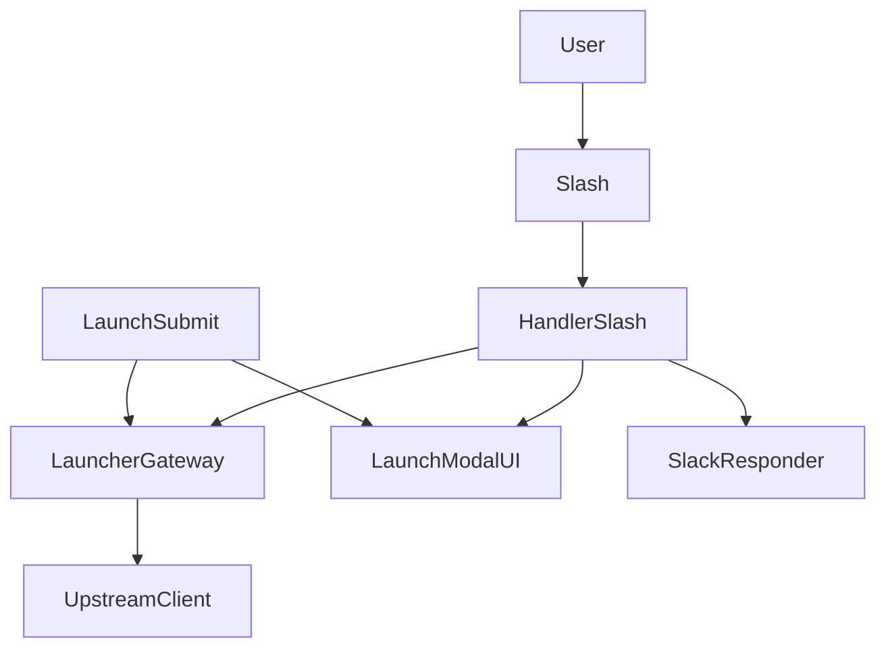
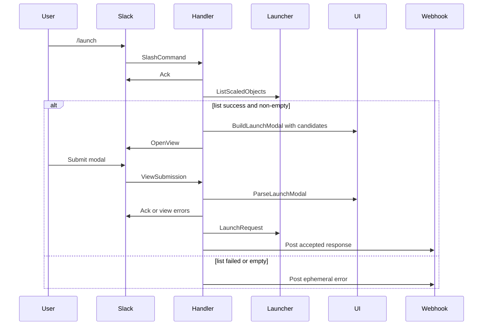

# Design Document

## Overview

この feature は、Slack `/launch` の初回 modal を自由記載フォームから候補選択フォームへ置き換える。利用者は KEDA launcher が認識している ScaledObject 一覧から対象を選び、duration と組み合わせて launch request を送る。

既存の `internal/kedalaunch` は、`handler` が Slack event と外部送信の orchestration を行い、`ui` が modal/message の artifact と parse を持つ構造に整理されている。この設計ではその境界を維持したまま、slash command 開始時の一覧取得と dropdown artifact への置換だけを追加する。

### Goals
- `/launch` 実行時に既知の ScaledObject 候補を modal に表示する
- 利用者が namespace と ScaledObject 名を手入力せずに launch request を作成できるようにする
- 候補取得失敗時と候補ゼロ時は modal を開かずに理由を通知する
- 既存の ack ルール、launch submit、accepted response フローを壊さずに拡張する

### Non-Goals
- accepted response の change duration / cancel フローの再設計
- 自由記載入力へのフォールバック
- 候補検索専用 API や multi-step wizard の追加
- upstream `keda-launcher-scaler` 側の一覧生成ロジック変更

## Boundary Commitments

### This Spec Owns
- `/launch` 初回 modal の候補選択 UI
- slash command 開始時の ScaledObject 一覧取得とその利用者通知
- 候補選択 submit から `LaunchRequest` を復元する contract
- feature-local KEDA launcher seam への `ListScaledObjects` 追加と timeout policy

### Out of Boundary
- accepted response 後の lifecycle action
- KEDA launcher receiver がどの ScaledObject を一覧に含めるかの意味論
- Slack app の interactivity 設定や外部 option load endpoint
- 候補数が Slack 制約を超える場合の別 UX 導入

### Allowed Dependencies
- `github.com/slack-go/slack` と `socketmode`
- `github.com/Kotaro7750/keda-launcher-scaler/pkg/client`
- `github.com/Kotaro7750/keda-launcher-scaler/pkg/client/http`
- 既存 `internal/kedalaunch/{handler,ui,keda_launcher_client,slack_responder}`

### Revalidation Triggers
- upstream `ListScaledObjects` の返却型やメソッド名変更
- Slack select menu の option / option group 制約変更
- launch modal の private metadata や callback ID の変更
- `/launch` の起動時に external select など別 interaction model が必要になった場合

## Architecture

### Existing Architecture Analysis
- `register.go` は `/launch` feature の composition root であり、upstream client の生成と callback 登録だけを持つ。
- `handler/slash_command.go` は初回 modal open の唯一の入口であり、ここに一覧取得を足すのが最小変更である。
- `ui/launch_modal.go` は launch modal の build と parse を一体で持っており、候補選択 UI への差し替えも同ファイルに閉じるのが自然である。
- `keda_launcher_client/launcher.go` は upstream 呼び出しに timeout を付ける feature-local seam であり、一覧取得もここに揃えると外部I/O境界が明確になる。

### Architecture Pattern & Boundary Map



**Architecture Integration**:
- Selected pattern: 既存 handler/ui/gateway split を保った extension
- Domain/feature boundaries: handler は一覧取得と利用者通知、ui は候補 UI と parse、gateway は upstream contract と timeout
- Existing patterns preserved: ack-first、artifact-near-file、feature-local seam
- New components rationale: 新 package は作らず、既存 3 箇所に責務を追加するだけで足りる
- Steering compliance: user flow 軸の file 配置と、外部送信と Slack 応答の分離を維持する

### Technology Stack

| Layer | Choice / Version | Role in Feature | Notes |
|-------|------------------|-----------------|-------|
| Frontend / CLI | Slack Block Kit via `slack-go/slack v0.23.0` | dropdown modal の build と view state parse | static select と option group を使用 |
| Backend / Services | Go 1.26.2 | slash command orchestration | 既存 `internal/kedalaunch` を拡張 |
| Data / Storage | none | 永続化なし | launch target は modal state から即時復元 |
| Infrastructure / Runtime | `keda-launcher-scaler v0.1.4` HTTP client | ScaledObject 一覧取得と launch 実行 | feature-local timeout policy を適用 |

## File Structure Plan

### Directory Structure
```text
internal/kedalaunch/
├── register.go                         # Composition root; upstream client を handler に渡す
├── handler/
│   ├── handler.go                      # 共有依存。ListScaledObjects を使う gateway を保持
│   ├── slash_command.go                # 一覧取得、失敗通知、modal open
│   ├── launch_submission.go            # 候補選択 submit の launch 実行
│   └── handler_test.go                 # slash / launch submit の orchestration test
├── keda_launcher_client/
│   ├── interface.go                    # Launch/Delete/List の upstream subset contract
│   ├── launcher.go                     # timeout 付き Launch/Cancel/List
│   └── launcher_test.go                # timeout policy test
├── slack_responder/
│   └── slack_responder.go              # ack、modal open、ephemeral/webhook post
└── ui/
    ├── helper.go                       # text/select 両方の state read helper
    ├── launch_modal.go                 # dropdown modal build と submit parse
    ├── launch_modal_test.go            # candidate option build と parse test
    └── accepted_message.go             # launch success response artifact
```

### Modified Files
- `internal/kedalaunch/handler/slash_command.go` — ack 後に一覧取得し、成功時だけ候補 modal を開く
- `internal/kedalaunch/handler/handler.go` — gateway が一覧取得も提供する前提の依存定義を維持する
- `internal/kedalaunch/handler/handler_test.go` — slash command の一覧取得成功・失敗・空結果と launch submit を検証する
- `internal/kedalaunch/keda_launcher_client/interface.go` — `ListScaledObjects` を追加する
- `internal/kedalaunch/keda_launcher_client/launcher.go` — timeout 付き `ListScaledObjects` ラッパーを追加する
- `internal/kedalaunch/keda_launcher_client/launcher_test.go` — list にも同じ timeout が適用されることを検証する
- `internal/kedalaunch/ui/helper.go` — select の selected option を読む helper と JSON value decode helper を追加する
- `internal/kedalaunch/ui/launch_modal.go` — text input modal を static select modal に置き換え、候補値から `LaunchRequest` を作る
- `internal/kedalaunch/ui/launch_modal_test.go` — option group build、JSON 選択値 decode、未選択 validation を検証する

## System Flows



Flow decisions:
- slash command は既存どおり先に ack し、その後に一覧取得する
- 候補が取得できない場合は modal を開かない
- submit 側は既存 flow と同じく validation error なら view response、成功なら accepted response post を使う

## Requirements Traceability

| Requirement | Summary | Components | Interfaces | Flows |
|-------------|---------|------------|------------|-------|
| 1.1 | `/launch` で候補付き modal を開く | `handler/slash_command.go`, `ui/launch_modal.go` | `ListScaledObjects`, `BuildLaunchModal` | slash to modal |
| 1.2 | 自由記載ではなく候補選択を使う | `ui/launch_modal.go` | `BuildLaunchModal` | slash to modal |
| 1.3 | namespace と ScaledObject を識別可能に表示する | `ui/launch_modal.go` | option group contract | slash to modal |
| 2.1 | 選択候補と duration から launch request を作る | `ui/launch_modal.go`, `handler/launch_submission.go` | `ParseLaunchModal`, `LaunchRequest` | submit to launch |
| 2.2 | accepted を利用者に通知する | `handler/launch_submission.go`, `ui/accepted_message.go` | existing webhook response contract | submit to launch |
| 2.3 | 未選択送信を拒否する | `ui/launch_modal.go`, `handler/launch_submission.go` | validation error map | submit to launch |
| 3.1 | 一覧取得失敗時は modal を開かず通知する | `handler/slash_command.go` | `ListScaledObjects`, `PostEphemeralError` | slash to error |
| 3.2 | 候補ゼロ時は modal を開かず通知する | `handler/slash_command.go` | `ListScaledObjects`, `PostEphemeralError` | slash to error |
| 3.3 | 一覧取得中も timeout で再試行を強いられない | `handler/slash_command.go`, `keda_launcher_client/launcher.go` | `AckWithSuccess`, list timeout | slash to modal/error |

## Components and Interfaces

| Component | Domain/Layer | Intent | Req Coverage | Key Dependencies | Contracts |
|-----------|--------------|--------|--------------|------------------|-----------|
| SlashCommandHandler | Handler | slash command の ack、一覧取得、modal open / error 通知 | 1.1, 3.1, 3.2, 3.3 | SlackResponder (P0), KedaLauncherGateway (P0), LaunchModalUI (P0) | Service |
| LaunchModalUI | UI | 候補 modal の build と submit parse | 1.2, 1.3, 2.1, 2.3 | Slack Block Kit (P0), domainclient (P1) | Service, State |
| KedaLauncherGateway | Gateway | timeout 付き List/Launch 呼び出し | 1.1, 2.1, 3.3 | upstream HTTP client (P0) | Service |
| LaunchSubmissionHandler | Handler | validation error / launch accepted の orchestration | 2.1, 2.2, 2.3 | LaunchModalUI (P0), KedaLauncherGateway (P0), SlackResponder (P0) | Service |

### Handler

#### SlashCommandHandler

| Field | Detail |
|-------|--------|
| Intent | slash command 開始時に一覧取得結果に応じて modal かエラー通知へ分岐する |
| Requirements | 1.1, 3.1, 3.2, 3.3 |

**Responsibilities & Constraints**
- SlashCommand payload を decode し、既存どおり最初に ack する
- 一覧取得成功かつ non-empty の場合だけ modal を開く
- 一覧取得失敗または empty の場合は modal を開かず、ephemeral error を返す
- launch target の整形や parse は `ui` に持ち込む

**Dependencies**
- Inbound: `register.go` — callback registration (P0)
- Outbound: `KedaLauncherGateway` — ScaledObject 一覧取得 (P0)
- Outbound: `LaunchModalUI` — modal artifact build (P0)
- Outbound: `SlackResponder` — ack / modal open / error post (P0)

**Contracts**: Service [x] / API [ ] / Event [ ] / Batch [ ] / State [ ]

##### Service Interface
```go
type slashCommandFlow interface {
    HandleSlashCommand(evt *socketmode.Event, client *socketmode.Client)
}
```
- Preconditions:
  - event data が `slack.SlashCommand` である
- Postconditions:
  - Slack へ ack が返る
  - 候補ありなら modal、失敗/空なら error notification のいずれかが実行される
- Invariants:
  - modal open 前に一覧取得結果を確定する
  - 一覧取得失敗時に自由記載 modal へフォールバックしない

**Implementation Notes**
- Integration: 既存 `OpenViewContext` と `PostEphemeralError` をそのまま使う
- Validation: `openViewCalls == 0` の failure/empty test を持つ
- Risks: upstream latency は ack 後に吸収されるが、利用者通知が遅すぎないことを timeout policy で担保する

#### LaunchSubmissionHandler

| Field | Detail |
|-------|--------|
| Intent | 候補選択 modal submit の validation、launch 実行、accepted response 投稿を行う |
| Requirements | 2.1, 2.2, 2.3 |

**Responsibilities & Constraints**
- `ui.ParseLaunchModal()` が返す validation error を Slack view error として返す
- valid な場合だけ `LaunchRequest` を実行する
- accepted response artifact 自体は既存 `ui/accepted_message.go` を再利用する

**Dependencies**
- Inbound: Slack view submission callback — launch submit entrypoint (P0)
- Outbound: `LaunchModalUI` — request build / validation (P0)
- Outbound: `KedaLauncherGateway` — LaunchRequest (P0)
- Outbound: `SlackResponder` — ack / webhook post / ephemeral error (P0)

**Contracts**: Service [x] / API [ ] / Event [ ] / Batch [ ] / State [ ]

##### Service Interface
```go
type launchSubmissionFlow interface {
    HandleLaunchSubmission(evt *socketmode.Event, client *socketmode.Client)
}
```
- Preconditions:
  - view private metadata が command invocation metadata として decode 可能
- Postconditions:
  - invalid input なら view error、valid input なら accepted response post
- Invariants:
  - request target は selected option の JSON value からのみ復元する

**Implementation Notes**
- Integration: accepted message の payload shape は既存のまま保つ
- Validation: fieldErrors に対象選択エラーが乗ることを確認する
- Risks: 一覧取得時点と submit 時点の upstream 状態差分は launch failure として既存 handling に流す

### UI

#### LaunchModalUI

| Field | Detail |
|-------|--------|
| Intent | ScaledObject 一覧を Slack select option group に変換し、submit state から request を復元する |
| Requirements | 1.2, 1.3, 2.1, 2.3 |

**Responsibilities & Constraints**
- `[]domainclient.ScaledObject` を namespace group 付き option set に変換する
- option value は namespace と name を含む JSON 文字列とし、decode helper で `ScaledObject` に戻す
- duration 入力は existing text input validation を維持する
- option group 構築は表示順を安定させ、同じ入力から同じ modal shape を生成する

**Dependencies**
- Inbound: `SlashCommandHandler` — candidate list を受け取る (P0)
- Inbound: `LaunchSubmissionHandler` — modal state parse を呼ぶ (P0)
- External: `slack-go/slack` — input/select blocks と option objects (P0)
- External: `domainclient` — `ScaledObject`, `LaunchRequest` (P1)

**Contracts**: Service [x] / API [ ] / Event [ ] / Batch [ ] / State [x]

##### Service Interface
```go
type launchModalContract interface {
    BuildLaunchModal(candidates []domainclient.ScaledObject) slack.ModalViewRequest
    ParseLaunchModal(view slack.View, now time.Time) (domainclient.LaunchRequest, map[string]string)
}
```
- Preconditions:
  - build には non-empty candidate list が渡される
  - parse では select action と duration action が view state に存在する
- Postconditions:
  - build は namespace/name 識別可能な select block を含む
  - parse は valid な選択値から `LaunchRequest` を返す
- Invariants:
  - `RequestID` 生成規則は既存と同じ
  - duration validation rule は変更しない

##### State Management
- State model:
  - `CommandInvocationMetadata` は slash command 文脈を維持する
  - selected target は view state の `SelectedOption.Value` に保持される
- Persistence & consistency:
  - 永続化なし、1 modal submit 内で完結
- Concurrency strategy:
  - shared mutable state は持たない

**Implementation Notes**
- Integration: `ui/helper.go` に select value read helper と JSON decode helper を追加する
- Validation: 未選択、壊れた option value、invalid duration を個別に field error 化する
- Risks: 候補数制約超過は build 前に handler/gateway で扱わず、revalidation trigger として明示する

### Gateway

#### KedaLauncherGateway

| Field | Detail |
|-------|--------|
| Intent | upstream client の Launch/Delete/List に feature-local timeout を適用する |
| Requirements | 1.1, 2.1, 3.3 |

**Responsibilities & Constraints**
- `LaunchRequest`, `CancelRequest`, `ListScaledObjects` の 3 操作を提供する
- timeout policy は 3 操作で統一する
- Slack notification や modal knowledge を持たない

**Dependencies**
- Inbound: `SlashCommandHandler`, `LaunchSubmissionHandler` — List / Launch 呼び出し (P0)
- External: upstream HTTP client — KEDA launcher API access (P0)

**Contracts**: Service [x] / API [ ] / Event [ ] / Batch [ ] / State [ ]

##### Service Interface
```go
type KedaLauncherIF interface {
    Launch(context.Context, domainclient.LaunchRequest) (domainclient.AcceptedRequest, error)
    ListScaledObjects(context.Context) ([]domainclient.ScaledObject, error)
    DeleteRequest(context.Context, domainclient.DeleteRequest) (domainclient.DeletedRequest, error)
}
```
- Preconditions:
  - upstream client が初期化済みである
- Postconditions:
  - 各操作は timeout 付き context で upstream へ委譲される
- Invariants:
  - feature-local timeout 値を一貫適用する

**Implementation Notes**
- Integration: `register.go` から渡される upstream HTTP client をそのまま包む
- Validation: launcher test で list も deadline を持つことを確認する
- Risks: upstream client の interface 変更時は compile error で顕在化する

## Data Models

### Domain Model
- `ScaledObject`:
  - `Namespace string`
  - `Name string`
- `LaunchTargetRef`:
  - logical only。option value に入る JSON 文字列の構造体
- `LaunchRequest`:
  - 既存どおり `requestId`, `scaledObject`, `duration`

### Data Contracts & Integration

**Modal Option Contract**

| Field | Meaning |
|-------|---------|
| option group label | namespace |
| option text | ScaledObject name |
| option value | `{"namespace":"...","name":"..."}` |

**Validation Rules**
- selected option が欠けている場合は target field error
- option value が JSON decode できない場合は target field error
- duration は既存と同じ positive Go duration 制約

## Error Handling

### Error Strategy
- Slash command failure:
  - 一覧取得失敗: modal を開かず `Failed to load launch targets.` を返す
  - 一覧空結果: modal を開かず `No launch targets are currently available.` を返す
- Submit validation failure:
  - target 未選択または壊れた value: field-level error
  - duration invalid: existing field-level error
- Launch execution failure:
  - 既存どおり `Launch request failed.` を返す

### Error Categories and Responses
- User Errors:
  - target 未選択 → modal 内 field error
  - duration invalid → modal 内 field error
- System Errors:
  - 一覧取得失敗 → ephemeral error, no modal
  - launch failure → ephemeral error after submit
- Business Logic Errors:
  - 候補ゼロ → no targets available notification

### Monitoring
- 一覧取得失敗時は既存 `slog.Error` と同じ logger path を使う
- log fields は `error` と slash command 文脈に限定し、UI candidate 全量は出さない

## Testing Strategy

### Unit Tests
- `ui/launch_modal_test.go`: candidate list から namespace group 付き select block が組み立てられることを検証する
- `ui/launch_modal_test.go`: selected option の JSON value から `LaunchRequest` が正しく復元されることを検証する
- `ui/launch_modal_test.go`: target 未選択、壊れた target value、invalid duration が field error になることを検証する
- `keda_launcher_client/launcher_test.go`: `ListScaledObjects` にも launch/cancel と同じ timeout が適用されることを検証する

### Integration Tests
- `handler/handler_test.go`: slash command 成功時に一覧取得後の modal open が行われ、error post が出ないことを検証する
- `handler/handler_test.go`: 一覧取得失敗時に modal が開かれず、ephemeral error が 1 件返ることを検証する
- `handler/handler_test.go`: 一覧空結果時に modal が開かれず、no targets notification が返ることを検証する
- `handler/handler_test.go`: launch submit 成功時に selected target から launch request が作られ、accepted response が post されることを検証する
- `handler/handler_test.go`: launch submit validation error 時に upstream launch が呼ばれないことを検証する

### E2E/UI Tests
- `/launch` 実行者が候補を選び、accepted response を受け取る主要フロー
- `/launch` 実行時に upstream 一覧取得が失敗し、modal が開かず理由だけ通知されるフロー
- `/launch` 実行時に候補が存在せず、利用者が状況を判断できる通知を受けるフロー
